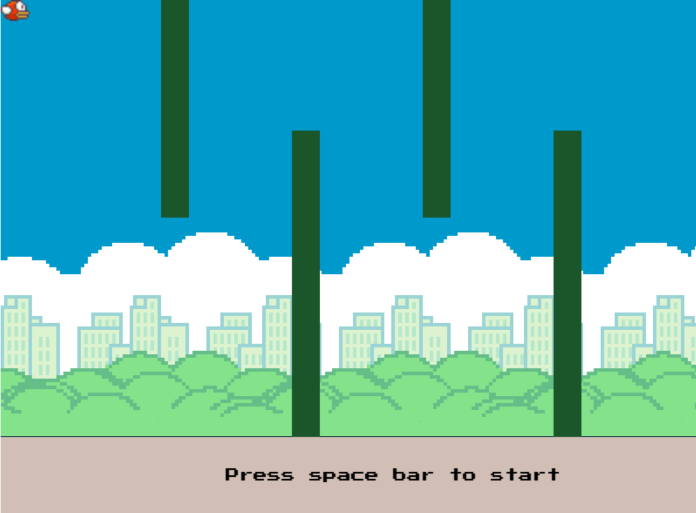

# 🕹️ Flappy Bird - Phaser.js Edition

> Proyecto desarrollado en **JavaScript** usando el framework **Phaser 3**  
> Inspirado en el clásico juego *Flappy Bird*, con detección de colisiones, física arcade y animaciones básicas.

---

## 📖 Descripción General
Este proyecto recrea el juego **Flappy Bird**, donde el jugador controla un ave que debe volar evitando chocar con columnas o caer al suelo.  
Fue desarrollado con **Phaser.js**, un framework para crear videojuegos 2D en el navegador, utilizando el motor de física **Arcade**.

El objetivo es aplicar los conceptos de:
- **Ciclo de vida de un juego (preload → create → update)**
- **Simulación física 2D**
- **Gestión de sprites y colisiones**
- **Entrada del teclado**




---

## ⚙️ Tecnologías Utilizadas
- 🧠 **Lenguaje:** JavaScript (ES6)
- 🎮 **Framework:** Phaser 3
- ⚡ **Motor de Física:** Arcade Physics

---

## 🧪 Cómo Ejecutar el Proyecto

### ✅ Opción 1 — Abrir localmente
1. Descarga o clona este repositorio.  
2. Asegúrate de tener los archivos en la estructura mostrada.  
3. Abre `index.html` en tu navegador.  

### 🌍 Opción 2 — Servidor local (recomendado)
Ejecuta el siguiente comando en la terminal:
```bash
npx live-server
```
Esto abrirá el juego automáticamente en tu navegador.

---

## 👨‍💻 Autor
**Nombre:** Dani Calderón 
**Proyecto:** Flappy Bird con Phaser.js  

---


